## 概述

本算法用于对任务与PDC进行映射，本算法综合考虑**硬件实现难度与平均性**，使用双重CRC算法，结合bank分组，尽量保证能够在大负载下减少PDC映射的冲突性。

## 代码

```C++
    int mux_tx_to_pdc_id(struct ses_tx *tx)
    {

        // 1. 按目的FA分区（banking）

        uint32_t bank = hash_fa(tx->destinationFA) & BANK_MASK;

        // 2. 构造key并计算两次独立哈希

        uint64_t key = ((uint64_t)tx->JobID << JOBID_SHIFT) |
                       ((uint64_t)tx->destinationFA << DEST_FA_SHIFT) |
                       ((uint64_t)tx->trafficclass << TC_SHIFT) |
                       ((uint64_t)tx->deliverymode << DM_SHIFT);
        uint16_t h1 = crc16_hash(key, CRC16_POLY1, HASH_SEED1);
        uint16_t h2 = crc16_hash(key, CRC16_POLY2, HASH_SEED2);

        // 3. 映射为bank内索引（使用掩码，确保PDCs_PER_BANK是2的幂）

        uint32_t i1 = h1 & (PDCs_PER_BANK - 1);
        uint32_t i2 = h2 & (PDCs_PER_BANK - 1);

        // 4. 读取两个候选PDC的轻量状态

        uint8_t q1 = pdc_qdepth[bank][i1];
        uint8_t q2 = pdc_qdepth[bank][i2];

        // 5. 选择更优者（队列深度更小的）

        uint32_t pick = (q1 <= q2) ? i1 : i2;
        if (pdc_qdepth[bank][pick] >= MAX_PDC_QUEUE)
        {
            log_error("选择的PDC索引超出范围: " + std::to_string(pick));
            return -1; // 队列深度超出范围
        }

        // 6. 生成全局PDCID

        uint32_t pdcid = (bank << BANK_SHIFT) | pick;

        // 验证PDCID范围
        if (pdcid >= MAX_PDC)
        {
            log_error("生成的PDCID超出范围: " + std::to_string(pdcid));
            return -1;
        }
        // 更新选中PDC的队列深度计数器（简化版本，实际应该在PDC处理完成后递减）
        pdc_qdepth[bank][pick]++;
        log_info("PDC分配算法 - Bank: " + std::to_string(bank) +
                 ", 候选1: " + std::to_string(i1) + "(深度:" + std::to_string(q1) + ")" +
                 ", 候选2: " + std::to_string(i2) + "(深度:" + std::to_string(q2) + ")" +
                 ", 选择: " + std::to_string(pick) +
                 ", 最终PDCID: " + std::to_string(pdcid));
        return static_cast<int>(pdcid);

    }
```

本代码主要通过以下流程实现PDCID的映射，其输入是`ses_tx`结构体，输出是对应的PDCID

```mermaid
flowchart LR
    A[开始] --> B[记录输入参数日志]
    B --> C[按FA分区<br/>bank = hash_fa & BANK_MASK]
    C --> D[构造key<br/>JobID<<24 + FA<<16 + TC<<8 + DM]
    
    D --> E[双哈希计算]
    E --> F[h1 = crc16_hash POLY1]
    E --> G[h2 = crc16_hash POLY2]
    
    F --> H[i1 = h1 & PDCs_PER_BANK-1]
    G --> I[i2 = h2 & PDCs_PER_BANK-1]
    
    H --> J[读取队列深度]
    I --> J
    J --> K[q1 = pdc_qdepth bank i1]
    J --> L[q2 = pdc_qdepth bank i2]
    
    K --> M{q1 <= q2?}
    L --> M
    M -->|是| N[pick = i1]
    M -->|否| O[pick = i2]
    
    N --> P{队列深度检查<br/>pick >= MAX_QUEUE?}
    O --> P
    P -->|是| Q[错误: 队列满] --> R[返回 -1]
    P -->|否| S[生成PDCID<br/>bank<<SHIFT + pick]
    
    S --> T{PDCID范围检查<br/>pdcid >= MAX_PDC?}
    T -->|是| U[错误: ID超范围] --> V[返回 -1]
    T -->|否| W[更新队列深度<br/>pdc_qdepth++]
    
    W --> X[记录成功日志]
    X --> Y[返回 pdcid]
    
    style A fill:#e1f5fe
    style Y fill:#e8f5e8
    style R fill:#ffcdd2
    style V fill:#ffcdd2
    style Q fill:#ffebee
    style U fill:#ffebee

```



通过选择不同的hash种子，可以将四元组映射到某个特定的PDC中进行处理，本算法综合考虑以下特性：
1. 算法的硬件可实现性：本算法采用的crc16算法在硬件实现方面相对简单。
``` Verilog
module CRC16_D16;
  // polynomial: x^16 + x^12 + x^5 + 1
  // data width: 16
  // convention: the first serial bit is D[15]
  function [15:0] nextCRC16_D16;

    input [15:0] Data;
    input [15:0] crc;
    reg [15:0] d;
    reg [15:0] c;
    reg [15:0] newcrc;
  begin
    d = Data;
    c = crc;
    newcrc[0] = d[12] ^ d[11] ^ d[8] ^ d[4] ^ d[0] ^ c[0] ^ c[4] ^ c[8] ^ c[11] ^ c[12];
    newcrc[1] = d[13] ^ d[12] ^ d[9] ^ d[5] ^ d[1] ^ c[1] ^ c[5] ^ c[9] ^ c[12] ^ c[13];
    newcrc[2] = d[14] ^ d[13] ^ d[10] ^ d[6] ^ d[2] ^ c[2] ^ c[6] ^ c[10] ^ c[13] ^ c[14];
    newcrc[3] = d[15] ^ d[14] ^ d[11] ^ d[7] ^ d[3] ^ c[3] ^ c[7] ^ c[11] ^ c[14] ^ c[15];
    newcrc[4] = d[15] ^ d[12] ^ d[8] ^ d[4] ^ c[4] ^ c[8] ^ c[12] ^ c[15];
    newcrc[5] = d[13] ^ d[12] ^ d[11] ^ d[9] ^ d[8] ^ d[5] ^ d[4] ^ d[0] ^ c[0] ^ c[4] ^ c[5] ^ c[8] ^ c[9] ^ c[11] ^ c[12] ^ c[13];
    newcrc[6] = d[14] ^ d[13] ^ d[12] ^ d[10] ^ d[9] ^ d[6] ^ d[5] ^ d[1] ^ c[1] ^ c[5] ^ c[6] ^ c[9] ^ c[10] ^ c[12] ^ c[13] ^ c[14];
    newcrc[7] = d[15] ^ d[14] ^ d[13] ^ d[11] ^ d[10] ^ d[7] ^ d[6] ^ d[2] ^ c[2] ^ c[6] ^ c[7] ^ c[10] ^ c[11] ^ c[13] ^ c[14] ^ c[15];
    newcrc[8] = d[15] ^ d[14] ^ d[12] ^ d[11] ^ d[8] ^ d[7] ^ d[3] ^ c[3] ^ c[7] ^ c[8] ^ c[11] ^ c[12] ^ c[14] ^ c[15];
    newcrc[9] = d[15] ^ d[13] ^ d[12] ^ d[9] ^ d[8] ^ d[4] ^ c[4] ^ c[8] ^ c[9] ^ c[12] ^ c[13] ^ c[15];
    newcrc[10] = d[14] ^ d[13] ^ d[10] ^ d[9] ^ d[5] ^ c[5] ^ c[9] ^ c[10] ^ c[13] ^ c[14];
    newcrc[11] = d[15] ^ d[14] ^ d[11] ^ d[10] ^ d[6] ^ c[6] ^ c[10] ^ c[11] ^ c[14] ^ c[15];
    newcrc[12] = d[15] ^ d[8] ^ d[7] ^ d[4] ^ d[0] ^ c[0] ^ c[4] ^ c[7] ^ c[8] ^ c[15];
    newcrc[13] = d[9] ^ d[8] ^ d[5] ^ d[1] ^ c[1] ^ c[5] ^ c[8] ^ c[9];
    newcrc[14] = d[10] ^ d[9] ^ d[6] ^ d[2] ^ c[2] ^ c[6] ^ c[9] ^ c[10];
    newcrc[15] = d[11] ^ d[10] ^ d[7] ^ d[3] ^ c[3] ^ c[7] ^ c[10] ^ c[11];
    nextCRC16_D16 = newcrc;
  end
  endfunction
endmodule
```
2. 算法可以尽量消减可能存在的冲突，通过目标FA提前分流，再通过移位和CRC之后的序列应该大体呈现随机性，在很大程度上避免超出PDC的处理能力