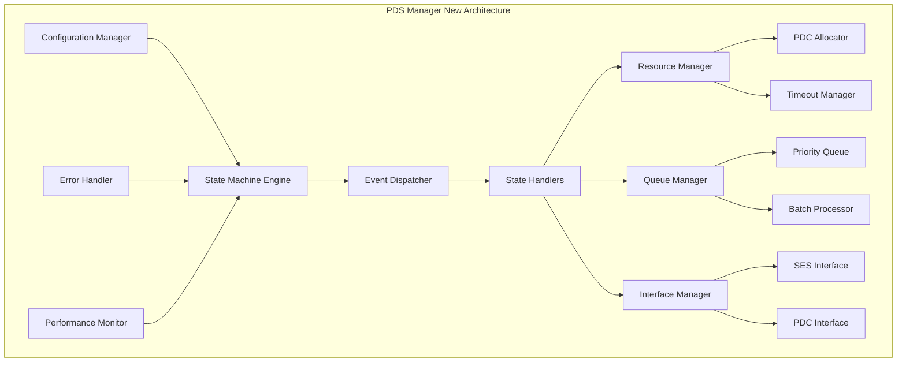

# PDS Manager重构建议和实施方案

## 1. 重构目标和原则

### 1.1 重构目标
- 🎯 **实现完整的状态机模式**：符合状态机图的设计规范
- 🎯 **提升代码可维护性**：清晰的模块划分和接口设计
- 🎯 **增强系统可靠性**：完善的错误处理和恢复机制
- 🎯 **优化性能表现**：高效的资源管理和算法实现
- 🎯 **提高可扩展性**：支持未来功能扩展和配置调整

### 1.2 重构原则
- **渐进式重构**：分阶段实施，确保系统稳定性
- **向后兼容**：保持现有接口的兼容性
- **测试驱动**：每个重构步骤都有相应的测试覆盖
- **文档同步**：代码重构的同时更新相关文档

## 2. 重构架构设计

### 2.1 整体架构重新设计



### 2.2 核心组件设计

#### 2.2.1 状态机引擎
```cpp
class StateMachineEngine {
public:
    enum State {
        INITIALIZE,
        IDLE,
        PEND_TIMEOUT,
        CLOSE_PEND_DEQ,
        SES_TX_REQ,
        RX_PKT,
        SES_TX_RSP,
        RESOURCE_CHECK,
        TX_OOR_PEND_Q,
        FWD_PKT_TO_PDC,
        UNEXPECTED_RX_OOR
    };
    
    enum Event {
        INIT_EVENT,
        PEND_TIME_EXPIRED,
        PDC_CLOSE_REQ,
        SES_TX_REQ_EVENT,
        RX_PKT_EVENT,
        SES_TX_RSP_EVENT,
        RESOURCE_CHECK_EVENT,
        TX_OOR_EVENT,
        FWD_PKT_EVENT,
        UNEXPECTED_EVENT
    };
    
private:
    State current_state_;
    std::map<std::pair<State, Event>, State> transition_table_;
    std::map<State, std::unique_ptr<StateHandler>> state_handlers_;
    
public:
    void initialize();
    bool process_event(Event event, const EventData& data);
    State get_current_state() const { return current_state_; }
    void register_state_handler(State state, std::unique_ptr<StateHandler> handler);
};
```

#### 2.2.2 事件分发器
```cpp
class EventDispatcher {
public:
    struct EventData {
        Event event_type;
        void* data;
        std::chrono::system_clock::time_point timestamp;
        int priority;
    };
    
private:
    std::priority_queue<EventData, std::vector<EventData>, EventComparator> event_queue_;
    std::mutex queue_mutex_;
    std::condition_variable queue_cv_;
    
public:
    void dispatch_event(const EventData& event);
    bool get_next_event(EventData& event, std::chrono::milliseconds timeout);
    void clear_events();
    size_t get_queue_size() const;
};
```

#### 2.2.3 状态处理器基类
```cpp
class StateHandler {
public:
    virtual ~StateHandler() = default;
    virtual bool handle_entry(const EventData& event) = 0;
    virtual bool handle_exit() = 0;
    virtual State get_next_state(Event event) const = 0;
    
protected:
    StateMachineEngine* engine_;
    ResourceManager* resource_manager_;
    QueueManager* queue_manager_;
    InterfaceManager* interface_manager_;
};
```

## 3. 分阶段重构实施计划

### 3.1 第一阶段：核心状态机重构（紧急修复）

#### 3.1.1 修复关键bug
**时间估计：1-2天**

1. **修复超时判断逻辑错误**
```cpp
// 修复文件：PDS_manager_sm.cpp line 394
bool is_pend_node_over_time(pend_node node) {
    auto current_time = std::chrono::steady_clock::now();
    int time_now_ms = static_cast<int>(
        std::chrono::duration_cast<std::chrono::milliseconds>(
            current_time.time_since_epoch()
        ).count()
    );
    // 修复：应该是当前时间大于结束时间才算超时
    return time_now_ms > node.end_time;
}
```

2. **修复资源计数不一致问题**
```cpp
// 在PDC分配和释放时确保计数器一致性
bool alloc_pdc(int pdc_id) {
    std::lock_guard<std::mutex> lock(pdc_mutex_);  // 添加锁保护
    if (!pdc_list[pdc_id].is_open) {
        pdc_list[pdc_id].is_open = true;
        open_cnt++;  // 确保在这里增加计数
        return true;
    }
    return false;
}

void free_pdc(int pdc_id) {
    std::lock_guard<std::mutex> lock(pdc_mutex_);  // 添加锁保护
    if (pdc_list[pdc_id].is_open) {
        pdc_list[pdc_id].is_open = false;
        open_cnt--;  // 确保在这里减少计数
    }
}
```

#### 3.1.2 实现基础状态机框架
**时间估计：3-5天**

```cpp
// 新文件：state_machine_engine.hpp
class PDS_StateMachine {
private:
    enum State current_state_ = State::INITIALIZE;
    
    // 状态转换表
    std::map<std::pair<State, Event>, State> transition_table_ = {
        {{State::INITIALIZE, Event::INIT_COMPLETE}, State::IDLE},
        {{State::IDLE, Event::PEND_TIME_EXPIRED}, State::PEND_TIMEOUT},
        {{State::IDLE, Event::PDC_CLOSE_REQ}, State::CLOSE_PEND_DEQ},
        {{State::IDLE, Event::SES_TX_REQ_EVENT}, State::SES_TX_REQ},
        // ... 其他转换规则
    };
    
    // 状态处理函数映射
    std::map<State, std::function<void(const EventData&)>> state_handlers_;
    
public:
    void initialize_state_machine();
    bool process_event(Event event, const EventData& data);
    void register_state_handlers();
};
```

### 3.2 第二阶段：接口和算法优化（核心功能）

#### 3.2.1 实现完整的SES接口
**时间估计：5-7天**

```cpp
// 新文件：ses_interface.hpp
class SES_Interface_Impl : public SES_Interface {
private:
    std::queue<Response_Message> response_queue_;
    std::mutex response_mutex_;
    
public:
    int send_response_to_ses(const ses_tx& request, 
                           const Response_Result& result) override {
        std::lock_guard<std::mutex> lock(response_mutex_);
        
        Response_Message msg;
        msg.job_id = request.JobID;
        msg.msg_id = request.msgid;
        msg.result = result;
        msg.timestamp = std::chrono::system_clock::now();
        
        response_queue_.push(msg);
        
        // 实际发送逻辑
        return send_to_ses_layer(msg);
    }
    
    int report_error_to_ses(const Error_Info& error) override {
        Error_Message err_msg;
        err_msg.error_type = error.type;
        err_msg.error_code = error.error_code;
        err_msg.description = error.description;
        
        return send_error_to_ses_layer(err_msg);
    }
};
```

#### 3.2.2 改进PDC分配算法
**时间估计：3-4天**

```cpp
// 新文件：pdc_allocator.hpp
class Advanced_PDC_Allocator {
public:
    enum AllocationStrategy {
        ROUND_ROBIN,
        LEAST_LOADED,
        HASH_CONSISTENT,
        WEIGHTED_ROUND_ROBIN
    };
    
private:
    struct PDC_Stats {
        int current_load;
        int total_requests;
        std::chrono::system_clock::time_point last_used;
        bool is_locked;
        float weight;
    };
    
    std::array<PDC_Stats, MAX_PDC> pdc_stats_;
    AllocationStrategy strategy_;
    int round_robin_index_;
    
public:
    int allocate_pdc(const ses_tx& request) {
        switch (strategy_) {
            case ROUND_ROBIN:
                return allocate_round_robin();
            case LEAST_LOADED:
                return allocate_least_loaded();
            case HASH_CONSISTENT:
                return allocate_hash_based(request);
            case WEIGHTED_ROUND_ROBIN:
                return allocate_weighted_round_robin();
        }
        return -1;
    }
    
private:
    int allocate_least_loaded() {
        int min_load = std::numeric_limits<int>::max();
        int selected_pdc = -1;
        
        for (int i = 0; i < MAX_PDC; ++i) {
            if (!pdc_list_[i].is_open && pdc_stats_[i].current_load < min_load) {
                min_load = pdc_stats_[i].current_load;
                selected_pdc = i;
            }
        }
        return selected_pdc;
    }
};
```

#### 3.2.3 实现高级资源管理
**时间估计：4-5天**

```cpp
// 新文件：resource_manager.hpp
class Advanced_Resource_Manager {
public:
    enum CloseStrategy {
        LRU,           // 最近最少使用
        FIFO,          // 先进先出
        LOAD_BASED,    // 基于负载
        HYBRID         // 混合策略
    };
    
private:
    struct Resource_Policy {
        int max_open_pdc;
        int close_threshold;
        CloseStrategy close_strategy;
        std::chrono::milliseconds idle_timeout;
        float load_balance_factor;
    };
    
    Resource_Policy policy_;
    std::deque<int> pdc_usage_order_;  // 用于LRU和FIFO
    
public:
    bool should_close_pdc() const {
        return (open_cnt - closing_cnt) > policy_.close_threshold;
    }
    
    int select_pdc_to_close() {
        switch (policy_.close_strategy) {
            case LRU:
                return select_lru_pdc();
            case FIFO:
                return select_fifo_pdc();
            case LOAD_BASED:
                return select_lowest_load_pdc();
            case HYBRID:
                return select_hybrid_pdc();
        }
        return -1;
    }
    
private:
    int select_lru_pdc() {
        // 选择最久未使用的PDC
        for (auto it = pdc_usage_order_.rbegin(); 
             it != pdc_usage_order_.rend(); ++it) {
            if (pdc_list_[*it].is_open && !is_pdc_locked(*it)) {
                return *it;
            }
        }
        return -1;
    }
};
```

### 3.3 第三阶段：性能和可靠性优化（扩展功能）

#### 3.3.1 实现高性能队列管理
**时间估计：6-8天**

```cpp
// 新文件：queue_manager.hpp
class High_Performance_Queue_Manager {
public:
    template<typename T>
    class Lock_Free_Queue {
    private:
        struct Node {
            std::atomic<T*> data;
            std::atomic<Node*> next;
        };
        
        std::atomic<Node*> head_;
        std::atomic<Node*> tail_;
        
    public:
        void enqueue(T item) {
            Node* new_node = new Node;
            T* data = new T(std::move(item));
            new_node->data.store(data);
            new_node->next.store(nullptr);
            
            Node* prev_tail = tail_.exchange(new_node);
            prev_tail->next.store(new_node);
        }
        
        bool dequeue(T& result) {
            Node* head = head_.load();
            Node* next = head->next.load();
            
            if (next == nullptr) {
                return false;  // Queue is empty
            }
            
            T* data = next->data.load();
            if (data == nullptr) {
                return false;
            }
            
            result = *data;
            delete data;
            head_.store(next);
            delete head;
            
            return true;
        }
    };
    
    // 批处理机制
    class Batch_Processor {
    private:
        static constexpr int MAX_BATCH_SIZE = 64;
        std::vector<EventData> batch_buffer_;
        
    public:
        template<typename Container>
        size_t collect_batch(Container& source, 
                           std::chrono::milliseconds max_wait) {
            batch_buffer_.clear();
            
            auto start_time = std::chrono::steady_clock::now();
            
            while (batch_buffer_.size() < MAX_BATCH_SIZE) {
                EventData event;
                if (source.try_dequeue(event)) {
                    batch_buffer_.push_back(event);
                } else {
                    auto elapsed = std::chrono::steady_clock::now() - start_time;
                    if (elapsed >= max_wait) {
                        break;
                    }
                    std::this_thread::yield();
                }
            }
            
            return batch_buffer_.size();
        }
        
        const std::vector<EventData>& get_batch() const {
            return batch_buffer_;
        }
    };
};
```

#### 3.3.2 实现完整的错误处理系统
**时间估计：4-5天**

```cpp
// 新文件：error_handler.hpp
class Comprehensive_Error_Handler {
public:
    enum Error_Level {
        INFO,
        WARNING,
        ERROR,
        CRITICAL
    };
    
    struct Error_Context {
        Error_Level level;
        std::string component;
        std::string operation;
        std::string description;
        std::map<std::string, std::string> parameters;
        std::chrono::system_clock::time_point timestamp;
    };
    
private:
    std::queue<Error_Context> error_queue_;
    std::map<std::string, int> error_counters_;
    std::function<void(const Error_Context&)> external_error_handler_;
    
public:
    void report_error(const Error_Context& context) {
        // 记录错误
        error_queue_.push(context);
        error_counters_[context.component + "::" + context.operation]++;
        
        // 根据错误级别采取不同行动
        switch (context.level) {
            case CRITICAL:
                handle_critical_error(context);
                break;
            case ERROR:
                handle_error(context);
                break;
            case WARNING:
                handle_warning(context);
                break;
            case INFO:
                handle_info(context);
                break;
        }
        
        // 通知外部错误处理器
        if (external_error_handler_) {
            external_error_handler_(context);
        }
    }
    
    // 错误恢复机制
    bool attempt_recovery(const Error_Context& context) {
        if (context.component == "PDC") {
            return recover_pdc_error(context);
        } else if (context.component == "SES") {
            return recover_ses_error(context);
        } else if (context.component == "Queue") {
            return recover_queue_error(context);
        }
        return false;
    }
    
private:
    void handle_critical_error(const Error_Context& context) {
        // 关键错误处理：保存状态，通知上层，准备降级
        save_current_state();
        notify_critical_error(context);
        
        // 尝试恢复
        if (!attempt_recovery(context)) {
            initiate_graceful_shutdown();
        }
    }
    
    bool recover_pdc_error(const Error_Context& context) {
        // PDC相关错误恢复逻辑
        if (context.operation == "allocation") {
            // 重新分配PDC
            return try_reallocate_pdc();
        } else if (context.operation == "communication") {
            // 重建PDC连接
            return try_reconnect_pdc();
        }
        return false;
    }
};
```

#### 3.3.3 性能监控和统计系统
**时间估计：3-4天**

```cpp
// 新文件：performance_monitor.hpp
class Performance_Monitor {
public:
    struct Performance_Metrics {
        // 吞吐量指标
        std::atomic<uint64_t> total_requests{0};
        std::atomic<uint64_t> successful_requests{0};
        std::atomic<uint64_t> failed_requests{0};
        
        // 延迟指标
        std::atomic<uint64_t> total_latency_us{0};
        std::atomic<uint64_t> max_latency_us{0};
        std::atomic<uint64_t> min_latency_us{UINT64_MAX};
        
        // 资源使用指标
        std::atomic<int> current_open_pdcs{0};
        std::atomic<int> peak_open_pdcs{0};
        std::atomic<uint64_t> total_queue_size{0};
        std::atomic<uint64_t> peak_queue_size{0};
        
        // 错误率指标
        std::atomic<uint64_t> timeout_errors{0};
        std::atomic<uint64_t> allocation_errors{0};
        std::atomic<uint64_t> communication_errors{0};
    };
    
private:
    Performance_Metrics metrics_;
    std::chrono::system_clock::time_point start_time_;
    
    // 滑动窗口统计
    class Sliding_Window_Stats {
    private:
        std::deque<std::pair<std::chrono::system_clock::time_point, uint64_t>> data_;
        std::chrono::milliseconds window_size_;
        
    public:
        void add_sample(uint64_t value) {
            auto now = std::chrono::system_clock::now();
            data_.emplace_back(now, value);
            
            // 清理过期数据
            while (!data_.empty() && 
                   (now - data_.front().first) > window_size_) {
                data_.pop_front();
            }
        }
        
        double get_average() const {
            if (data_.empty()) return 0.0;
            
            uint64_t sum = 0;
            for (const auto& sample : data_) {
                sum += sample.second;
            }
            return static_cast<double>(sum) / data_.size();
        }
    };
    
    Sliding_Window_Stats latency_stats_;
    Sliding_Window_Stats throughput_stats_;
    
public:
    void record_request_start(uint64_t request_id) {
        auto now = std::chrono::high_resolution_clock::now();
        request_start_times_[request_id] = now;
        metrics_.total_requests++;
    }
    
    void record_request_end(uint64_t request_id, bool success) {
        auto now = std::chrono::high_resolution_clock::now();
        auto it = request_start_times_.find(request_id);
        
        if (it != request_start_times_.end()) {
            auto latency = std::chrono::duration_cast<std::chrono::microseconds>(
                now - it->second).count();
            
            metrics_.total_latency_us += latency;
            latency_stats_.add_sample(latency);
            
            // 更新最大/最小延迟
            uint64_t current_max = metrics_.max_latency_us.load();
            while (latency > current_max && 
                   !metrics_.max_latency_us.compare_exchange_weak(current_max, latency));
                   
            uint64_t current_min = metrics_.min_latency_us.load();
            while (latency < current_min && 
                   !metrics_.min_latency_us.compare_exchange_weak(current_min, latency));
            
            request_start_times_.erase(it);
        }
        
        if (success) {
            metrics_.successful_requests++;
        } else {
            metrics_.failed_requests++;
        }
    }
    
    Performance_Report generate_report() const {
        Performance_Report report;
        
        auto total_requests = metrics_.total_requests.load();
        auto successful_requests = metrics_.successful_requests.load();
        
        report.success_rate = total_requests > 0 ? 
            static_cast<double>(successful_requests) / total_requests : 0.0;
            
        report.average_latency_us = total_requests > 0 ?
            metrics_.total_latency_us.load() / total_requests : 0;
            
        report.current_throughput = throughput_stats_.get_average();
        report.peak_open_pdcs = metrics_.peak_open_pdcs.load();
        
        return report;
    }
    
private:
    std::unordered_map<uint64_t, std::chrono::high_resolution_clock::time_point> 
        request_start_times_;
};
```

## 4. 配置和管理系统

### 4.1 配置管理器设计
**时间估计：2-3天**

```cpp
// 新文件：configuration_manager.hpp
class Configuration_Manager {
public:
    struct PDC_Config {
        int max_pdc_count = 10;
        int close_threshold = 6;
        std::chrono::milliseconds base_rto{100};
        std::chrono::milliseconds pend_timeout{100};
    };
    
    struct Performance_Config {
        int max_batch_size = 64;
        std::chrono::milliseconds batch_timeout{10};
        bool enable_lock_free_queues = true;
        int thread_pool_size = 4;
    };
    
    struct Algorithm_Config {
        Advanced_PDC_Allocator::AllocationStrategy pdc_strategy = 
            Advanced_PDC_Allocator::LEAST_LOADED;
        Advanced_Resource_Manager::CloseStrategy close_strategy = 
            Advanced_Resource_Manager::LRU;
        bool enable_load_balancing = true;
    };
    
private:
    PDC_Config pdc_config_;
    Performance_Config perf_config_;
    Algorithm_Config algo_config_;
    
    std::string config_file_path_;
    std::mutex config_mutex_;
    
public:
    bool load_from_file(const std::string& file_path);
    bool save_to_file(const std::string& file_path) const;
    
    void update_pdc_config(const PDC_Config& config);
    void update_performance_config(const Performance_Config& config);
    void update_algorithm_config(const Algorithm_Config& config);
    
    const PDC_Config& get_pdc_config() const { return pdc_config_; }
    const Performance_Config& get_performance_config() const { return perf_config_; }
    const Algorithm_Config& get_algorithm_config() const { return algo_config_; }
    
    // 热更新支持
    void watch_config_file();
    void on_config_changed();
};
```

## 5. 测试策略和验证

### 5.1 单元测试框架
```cpp
// 新文件：tests/test_framework.hpp
class PDS_Manager_Test_Framework {
public:
    // 状态机测试
    void test_state_transitions();
    void test_error_recovery();
    void test_timeout_handling();
    
    // 算法测试
    void test_pdc_allocation_algorithms();
    void test_resource_management();
    void test_queue_management();
    
    // 性能测试
    void test_throughput_performance();
    void test_latency_performance();
    void test_memory_usage();
    
    // 压力测试
    void test_high_load_scenarios();
    void test_error_injection();
    void test_resource_exhaustion();
    
private:
    std::unique_ptr<PDS_manager_sm> test_instance_;
    Mock_SES_Interface mock_ses_;
    Mock_PDC_Interface mock_pdc_;
};
```

### 5.2 集成测试计划
1. **接口兼容性测试**：确保新实现与现有SES/PDC接口兼容
2. **性能基准测试**：对比重构前后的性能表现
3. **压力测试**：验证高负载下的系统稳定性
4. **故障恢复测试**：验证各种故障场景下的恢复能力

## 6. 实施时间表和里程碑

### 6.1 详细时间表

| 阶段 | 任务 | 预估时间 | 开始日期 | 结束日期 | 负责人 |
|-----|------|---------|---------|---------|-------|
| **第一阶段** | | | | | |
| 1.1 | 修复关键bug | 2天 | Day 1 | Day 2 | 核心开发者 |
| 1.2 | 实现基础状态机 | 5天 | Day 3 | Day 7 | 架构师+开发者 |
| 1.3 | 基础测试 | 2天 | Day 8 | Day 9 | 测试工程师 |
| **第二阶段** | | | | | |
| 2.1 | SES接口实现 | 7天 | Day 10 | Day 16 | 接口开发者 |
| 2.2 | PDC分配算法 | 4天 | Day 17 | Day 20 | 算法工程师 |
| 2.3 | 资源管理优化 | 5天 | Day 21 | Day 25 | 系统工程师 |
| 2.4 | 集成测试 | 3天 | Day 26 | Day 28 | 测试团队 |
| **第三阶段** | | | | | |
| 3.1 | 高性能队列 | 8天 | Day 29 | Day 36 | 性能工程师 |
| 3.2 | 错误处理系统 | 5天 | Day 37 | Day 41 | 可靠性工程师 |
| 3.3 | 性能监控 | 4天 | Day 42 | Day 45 | 监控工程师 |
| 3.4 | 压力测试 | 5天 | Day 46 | Day 50 | 测试团队 |

### 6.2 关键里程碑

- **M1 (Day 9)**：关键bug修复完成，基础状态机可用
- **M2 (Day 28)**：核心功能重构完成，接口测试通过
- **M3 (Day 45)**：性能优化完成，监控系统就位
- **M4 (Day 50)**：全面测试完成，系统可发布

## 7. 风险评估和缓解策略

### 7.1 技术风险

| 风险项 | 风险等级 | 影响 | 缓解策略 |
|-------|---------|------|---------|
| 状态机重构复杂度超预期 | 🟡 中 | 延期交付 | 分阶段实施，优先核心功能 |
| 性能优化效果不明显 | 🟡 中 | 无法达到性能目标 | 建立性能基准，持续监控 |
| 接口兼容性问题 | 🔴 高 | 系统无法集成 | 充分的接口测试，向后兼容设计 |
| 并发安全问题 | 🔴 高 | 系统不稳定 | 代码审查，并发测试 |

### 7.2 进度风险

| 风险项 | 风险等级 | 影响 | 缓解策略 |
|-------|---------|------|---------|
| 开发资源不足 | 🟡 中 | 进度延迟 | 合理分配任务，外部支持 |
| 测试时间不够 | 🟡 中 | 质量风险 | 并行开发测试，自动化测试 |
| 需求变更频繁 | 🟠 低 | 返工风险 | 需求冻结，变更控制 |

### 7.3 质量风险

| 风险项 | 风险等级 | 影响 | 缓解策略 |
|-------|---------|------|---------|
| 回归测试不充分 | 🟡 中 | 引入新bug | 完整的回归测试套件 |
| 文档更新不及时 | 🟠 低 | 维护困难 | 文档与代码同步更新 |
| 代码质量下降 | 🟡 中 | 长期维护成本增加 | 代码审查，静态分析 |

## 8. 成功标准和验收条件

### 8.1 功能验收标准
- ✅ 所有状态机图中的状态和转换都已实现
- ✅ SES和PDC接口功能完整可用
- ✅ 错误处理和恢复机制正常工作
- ✅ 资源管理策略有效运行
- ✅ 超时机制准确可靠

### 8.2 性能验收标准
- ✅ 吞吐量不低于当前实现的90%
- ✅ 平均延迟不超过当前实现的110%
- ✅ 内存使用量不超过当前实现的120%
- ✅ CPU使用率在高负载下不超过80%

### 8.3 质量验收标准
- ✅ 单元测试覆盖率达到85%以上
- ✅ 集成测试通过率达到100%
- ✅ 压力测试稳定运行24小时无崩溃
- ✅ 代码复杂度指标在合理范围内

## 9. 后续维护和演进

### 9.1 维护计划
- **定期代码审查**：每月一次代码质量检查
- **性能监控**：持续监控系统性能指标
- **安全更新**：及时修复发现的安全问题
- **文档维护**：保持技术文档的及时更新

### 9.2 演进路线图
- **短期（3个月）**：稳定现有功能，修复发现的问题
- **中期（6个月）**：增加高级功能，如智能负载均衡
- **长期（12个月）**：支持分布式部署，云原生架构

## 10. 结论

本重构方案提供了一个全面、系统的PDS Manager改进计划。通过分阶段的实施策略，可以在保证系统稳定性的前提下，逐步实现所有改进目标。重构后的系统将具备：

- 🎯 **完整的状态机实现**：符合设计规范，易于理解和维护
- 🎯 **高性能的处理能力**：优化的算法和数据结构
- 🎯 **可靠的错误处理**：完善的错误检测和恢复机制
- 🎯 **灵活的配置管理**：支持运行时配置调整
- 🎯 **全面的监控体系**：实时性能和健康状态监控

这个方案不仅解决了当前代码中存在的问题，还为未来的功能扩展奠定了坚实的基础。
