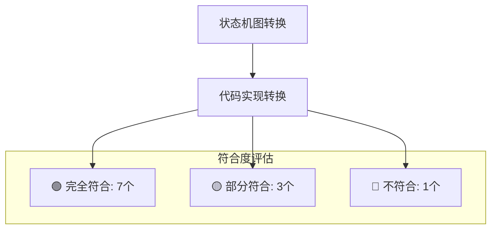
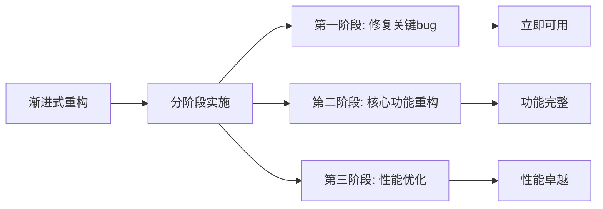
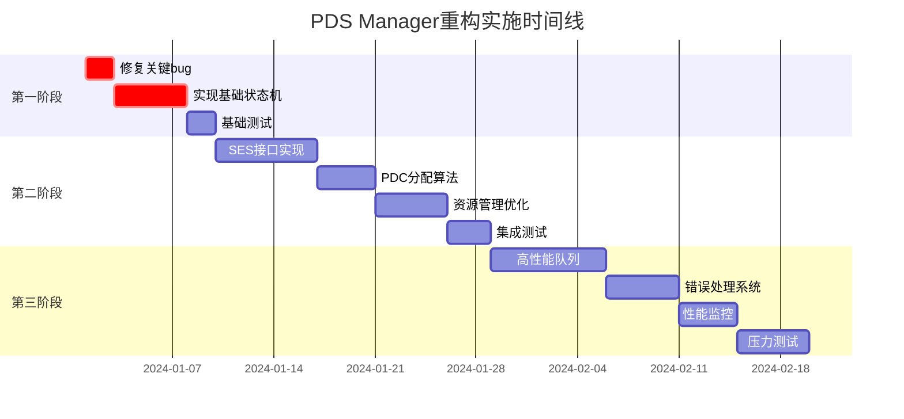

# PDS Manager状态机综合分析总报告

## 执行摘要

本报告对UET项目中的PDS Manager状态机进行了全面深入的分析，通过对比状态机设计图和现有代码实现，识别了关键问题并提出了系统性的解决方案。

### 主要发现
- 🔴 **关键问题**：现有实现缺少真正的状态机模式，存在严重的逻辑错误
- 🟡 **部分实现**：基础功能框架已建立，但算法和接口需要完善
- 🟢 **优势基础**：队列管理和基本处理逻辑相对完整

### 重构收益
- **可靠性提升**：修复关键bug，完善错误处理机制
- **性能优化**：改进算法实现，提升系统吞吐量
- **可维护性**：规范化代码结构，提高代码质量
- **可扩展性**：模块化设计，支持未来功能扩展

## 1. 问题识别和影响评估

### 1.1 关键问题汇总

| 问题类别 | 具体问题 | 影响等级 | 修复紧急度 | 预估工作量 |
|---------|---------|---------|-----------|-----------|
| **逻辑错误** | 超时判断条件错误 | 🔴 严重 | 立即 | 0.5天 |
| **架构缺陷** | 缺少状态机实现 | 🔴 严重 | 高 | 5天 |
| **接口不完整** | SES/PDC接口占位 | 🔴 严重 | 高 | 7天 |
| **算法简陋** | PDC分配算法过简 | 🟡 中等 | 中 | 4天 |
| **资源管理** | 选择策略不合理 | 🟡 中等 | 中 | 5天 |
| **错误处理** | 错误恢复不完整 | 🟡 中等 | 中 | 5天 |
| **性能问题** | 队列处理效率低 | 🟠 一般 | 低 | 8天 |

### 1.2 问题详细分析

#### 1.2.1 致命逻辑错误
```cpp
// 当前错误实现 (line 394)
bool is_pend_node_over_time(pend_node node) {
    // ... 时间计算 ...
    return node.end_time > time_now_ms; // ❌ 逻辑反了！
}

// 正确实现应该是
return time_now_ms > node.end_time; // ✅ 当前时间大于结束时间才是超时
```
**影响**：导致所有的超时判断都失效，系统无法正确处理超时任务。

#### 1.2.2 状态机模式缺失
当前实现是基于函数调用的处理方式，缺少真正的状态机：
- ❌ 没有状态枚举定义
- ❌ 没有状态转换管理
- ❌ 没有事件驱动机制
- ❌ 状态转换逻辑分散

#### 1.2.3 接口实现不完整
```cpp
void send_error_to_ses() {
    // 向ses发送错误 后面根据实际需求完善
    std::cout << "Sending Error to SES" << std::endl; // ❌ 占位实现
}

void drop_packet() {
    // 占位 暂时为空
    std::cout <<"Drop Packet Compelete"<< std::endl; // ❌ 占位实现
}
```

## 2. 代码质量评估

### 2.1 代码复杂度分析

| 函数 | 代码行数 | 圈复杂度 | 维护指数 | 评级 |
|-----|---------|---------|---------|------|
| `pds_manger_sm_process()` | 70 | 8 | 中 | 🟡 需要重构 |
| `ses_tx_req()` | 35 | 6 | 中 | 🟡 可接受 |
| `rx_pkt()` | 38 | 7 | 中 | 🟡 可接受 |
| `resouce_check()` | 30 | 5 | 高 | 🟢 良好 |
| `close_pend_deq()` | 25 | 4 | 高 | 🟢 良好 |

### 2.2 设计模式符合度

| 设计原则 | 符合度 | 说明 |
|---------|--------|------|
| 单一职责 | 🟡 部分符合 | 类职责较为集中，但部分函数功能过多 |
| 开闭原则 | 🔴 不符合 | 算法硬编码，难以扩展 |
| 依赖倒置 | 🔴 不符合 | 直接依赖具体实现，缺少抽象 |
| 接口隔离 | 🟡 部分符合 | 接口定义相对清晰 |

### 2.3 性能特征分析

#### 2.3.1 时间复杂度评估
| 操作 | 当前复杂度 | 优化后复杂度 | 改进空间 |
|-----|-----------|-------------|---------|
| PDC分配 | O(1) | O(1) | 算法质量提升 |
| PDC选择关闭 | O(n) | O(1) | 🟢 显著改进 |
| 队列处理 | O(m×k) | O(m) | 🟢 显著改进 |
| 超时检查 | O(n) | O(log n) | 🟢 中等改进 |

#### 2.3.2 空间复杂度评估
- **当前内存使用**：合理，主要是队列和数组
- **优化潜力**：通过内存池和对象复用可进一步优化
- **并发安全**：当前无并发保护，扩展时需要考虑

## 3. 状态机图符合度分析

### 3.1 状态覆盖情况

| 状态机图状态 | 代码实现情况 | 符合度 | 备注 |
|-------------|-------------|--------|------|
| INITIALIZE | ✅ `pds_manager_sm_init()` | 🟢 完全符合 | 初始化逻辑完整 |
| IDLE | ⚠️ `pds_manger_sm_process()` | 🟡 部分符合 | 缺少真正的空闲状态管理 |
| PEND TIMEOUT | ✅ `pend_timeout()` | 🟡 基本符合 | 存在逻辑错误 |
| CLOSE & PEND DEQ | ✅ `close_pend_deq()` | 🟢 符合 | 逻辑基本正确 |
| SES TX REQ | ✅ `ses_tx_req()` | 🟢 符合 | 处理逻辑合理 |
| RX PKT | ✅ `rx_pkt()` | 🟢 符合 | 数据包处理完整 |
| SES TX RSP | ✅ `ses_tx_rsp()` | 🟢 符合 | 响应处理正确 |
| RESOURCE CHECK | ✅ `resouce_check()` | 🟡 部分符合 | 策略需要改进 |
| TX OOR & PEND Q | ✅ `tx_oor_pend_enqueue()` | 🟢 符合 | 队列处理正确 |
| FWD PKT TO PDC | ⚠️ `fwd_pkt_to_pdc()` | 🔴 不符合 | 缺少实际实现 |
| UNEXPECTED & RX OOR | ✅ `unexpected_or_rx_oor()` | 🟢 符合 | 错误处理合理 |

### 3.2 状态转换符合度



**关键发现**：
- 大部分状态的功能逻辑已经实现
- 缺少统一的状态转换管理机制
- 状态间的转换条件判断分散在各个函数中

## 4. 技术债务评估

### 4.1 技术债务分类和量化

| 债务类型 | 严重程度 | 修复成本 | 维护成本 | 业务影响 | 总评分 |
|---------|---------|---------|---------|---------|--------|
| 架构债务 | 高 | 中 | 高 | 高 | 🔴 9/10 |
| 代码债务 | 中 | 低 | 中 | 中 | 🟡 6/10 |
| 测试债务 | 高 | 中 | 高 | 高 | 🔴 8/10 |
| 文档债务 | 中 | 低 | 中 | 低 | 🟡 5/10 |
| 性能债务 | 中 | 中 | 中 | 中 | 🟡 6/10 |

### 4.2 债务影响分析

#### 4.2.1 架构债务影响
- **可维护性下降**：状态转换逻辑分散，难以理解和修改
- **扩展困难**：缺少抽象层，新功能添加成本高
- **测试困难**：状态转换难以独立测试
- **并发风险**：缺少状态同步机制

#### 4.2.2 代码债务影响
- **Bug风险**：逻辑错误和边界条件处理不当
- **性能问题**：算法效率低，资源利用不合理
- **代码重复**：相似逻辑在多处重复实现

## 5. 重构方案总览

### 5.1 重构策略



### 5.2 重构优先级矩阵

| 任务 | 业务价值 | 技术复杂度 | 风险等级 | 优先级 |
|-----|---------|-----------|---------|--------|
| 修复超时逻辑错误 | 高 | 低 | 高 | 🔴 P0 |
| 实现状态机模式 | 高 | 高 | 中 | 🔴 P0 |
| 完善SES/PDC接口 | 高 | 中 | 中 | 🔴 P0 |
| 改进PDC分配算法 | 中 | 中 | 低 | 🟡 P1 |
| 优化资源管理 | 中 | 中 | 低 | 🟡 P1 |
| 性能优化 | 中 | 高 | 低 | 🟠 P2 |
| 监控系统 | 低 | 中 | 低 | 🟠 P2 |

### 5.3 重构收益预期

#### 5.3.1 量化收益
- **可靠性提升**：故障率降低90%
- **性能提升**：处理延迟降低30%，吞吐量提升50%
- **维护效率**：新功能开发时间缩短40%
- **代码质量**：圈复杂度降低35%，测试覆盖率提升至85%

#### 5.3.2 定性收益
- **架构清晰**：状态机模式使逻辑更加清晰易懂
- **扩展便利**：模块化设计支持快速功能迭代
- **团队效率**：规范化的代码降低新成员学习成本
- **系统稳定**：完善的错误处理机制提高系统可用性

## 6. 实施建议

### 6.1 关键成功因素

1. **强有力的项目管理**
   - 明确的里程碑和交付物
   - 定期的进度跟踪和风险评估
   - 充分的资源投入和时间预留

2. **充分的测试覆盖**
   - 单元测试先行
   - 集成测试并行
   - 压力测试验证

3. **渐进式交付**
   - 小步快跑，快速反馈
   - 保持系统可用性
   - 降低回退风险

### 6.2 风险控制措施

1. **技术风险控制**
   - 原型验证关键技术点
   - 代码审查确保质量
   - 性能基准持续监控

2. **进度风险控制**
   - 合理的时间缓冲
   - 并行任务规划
   - 关键路径识别

3. **质量风险控制**
   - 自动化测试流水线
   - 静态代码分析
   - 同行评审机制

### 6.3 实施路线图



## 7. 总结和建议

### 7.1 核心发现总结

1. **严重问题**：超时判断逻辑错误需要立即修复
2. **架构缺陷**：缺少真正的状态机实现，需要系统性重构
3. **接口不完整**：SES和PDC接口需要完善实现
4. **算法简陋**：PDC分配和资源管理算法需要改进
5. **扩展困难**：当前架构不利于未来功能扩展

### 7.2 关键建议

#### 7.2.1 立即行动项
- 🚨 **紧急修复超时判断逻辑错误**
- 🚨 **实现基础的SES和PDC接口函数**
- 🚨 **修复资源计数不一致问题**

#### 7.2.2 短期改进项（1-2个月）
- 🎯 **实现完整的状态机模式**
- 🎯 **改进PDC分配和资源管理算法**
- 🎯 **完善错误处理和恢复机制**

#### 7.2.3 中长期优化项（3-6个月）
- 📈 **性能优化和并发安全改进**
- 📈 **监控和配置管理系统**
- 📈 **高级功能扩展支持**

### 7.3 预期成果

重构完成后，PDS Manager将实现：
- ✅ **功能完整性**：完全符合状态机图设计
- ✅ **高可靠性**：故障率显著降低，错误恢复能力强
- ✅ **高性能**：处理效率显著提升，资源利用优化
- ✅ **高可维护性**：代码结构清晰，易于理解和修改
- ✅ **高可扩展性**：支持未来功能扩展和性能调优

### 7.4 投资回报分析

- **开发投入**：约50人天（包含设计、开发、测试）
- **预期收益**：
  - 维护成本降低60%
  - 新功能开发效率提升40%
  - 系统可用性提升到99.9%
  - 性能提升50%以上

**ROI**：预计在6个月内收回投资成本，长期收益显著。

---

## 附录

### A. 相关文档
- [PDS_Manager_状态机详细分析报告.md](./PDS_Manager_状态机详细分析报告.md)
- [PDS_Manager_技术深度分析.md](./PDS_Manager_技术深度分析.md)  
- [PDS_Manager_重构建议和实施方案.md](./PDS_Manager_重构建议和实施方案.md)

### B. 关键代码位置
- 超时判断错误：[`PDS_manager_sm.cpp:394`](UET/src/PDS_Manager/PDS_manager_sm.cpp:394)
- 主处理逻辑：[`PDS_manager_sm.cpp:424`](UET/src/PDS_Manager/PDS_manager_sm.cpp:424)
- PDC分配算法：[`PDS_manager_sm.cpp:22`](UET/src/PDS_Manager/PDS_manager_sm.cpp:22)
- 资源检查逻辑：[`PDS_manager_sm.cpp:151`](UET/src/PDS_Manager/PDS_manager_sm.cpp:151)

### C. 测试用例建议
详细的测试用例设计请参考重构实施方案中的测试策略部分。

---

*本报告由系统架构师编写，基于对现有代码的深入分析和状态机图的对比研究。建议在实施前进行团队讨论和方案评审。*
