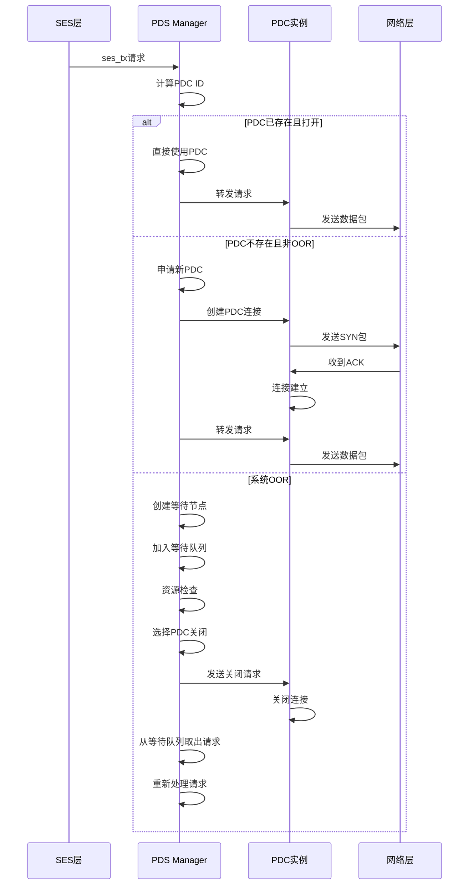

## 总览
![[Pasted image 20250723150037.png]]
从这张图开始认知总体设计，我们认为UET的协议主要分为这些部分：
1. libfabric APIs：这个部分主要是将上层应用与数据包的发送和接收进行映射。在计算机领域，绝大部分的层级设计都需要对上提供服务，对下发表指令，我们认为这个这部分主要用来接受指令之类的？
2. semantic语义层：讲上层的程序接口映射到具体的数据包，处理与数据传输相关的各种功能，例如排序等。
3. 包传输层:负责管理PDC,设置和删除PDC等内容，支持各种特性。
4. 拥塞管理
5. 安全层
## 数据传输流程
以这个图为例子![[Pasted image 20250723160746.png]]
这张图表示数据包传送的一个基本流程，它分为两个图，我们从上图开始阅读和了解整体的流程。
跟随所标记的顺序如下所述：
1. 发送端生成一个SES请求，SES层是语义子层，负责应用到传输的语义处理，所以我们认为这个部分向PDC发出了任务申请。
2. 发送端口通过PDS层生成了一个PDS请求，将SES传送到目标。
3. 目标的PDS将SES请求传送到接收端SES层
4. 目标SES层对请求进行响应
5. 响应文件通过PDS层打包以后回到发送端
6. PDS处理文件并交付到SES
从下图我们可以看出这个PDS发送的时候会携带PSN编号等内容。PSN编号用于标记数据包在序列中的位置，确认每一个包的顺序。
CLEAR字段表示数据包的信息已经过时或者清除。标记不需要的一个状态。
根据chatGPT的解释，我们认为这个数据传输的流程如下：
- **请求端（Initiator）发起数据传输**：
    - **SES请求**：请求端的**语义子层（SES）**生成一个**SES请求**，这个请求可能包括数据和传输要求。请求被封装在**PDS请求**（Packet Delivery Request）中，并通过网络发送到接收端。    
- **数据包传递**：
    - **PDS请求**：请求通过PDS（包传递子层）传输。PDS子层负责确保数据包的正确顺序和可靠交付。PDS使用**PSN（Packet Sequence Number）**来标识每个数据包，并确保数据包按顺序到达。
    - 数据包沿着以太网Fabric传递，**以太网Fabric**是网络的物理传输路径。
- **目标端（Target）接收数据并响应**：
    - **SES响应**：当目标端的**语义子层（SES）**接收到PDS请求时，它会处理这个请求，并生成一个**SES响应**，并可能携带数据（比如读取的响应数据）。这些响应数据可以通过PDS请求传回发起端。
- **回程数据传输**：
    - **PDS ACK（确认）**：在回程过程中，目标端使用**PDS ACK**（确认包）来确认已接收到请求端发送的包，并可能携带部分小的数据（如读取响应数据）。PDS ACK不应用拥塞控制，因为它只负责确认包的传递。
    - **较大数据的回传**：对于较大的读取响应数据，这些数据会通过**PDS请求**从目标端传回发起端。此时，回程数据会经过**拥塞控制**，确保网络不会发生拥塞。
- **拥塞控制**：
    - 在数据传输的回程过程中，拥塞控制会应用于较大的读取响应数据。它的目标是调节数据流的速率，避免网络拥塞，确保大规模数据的平稳传输。
- **传输的顺序性与可靠性**：
    - **PSN**确保每个数据包按顺序到达目标端，即使数据包经过不同路径传输，PSN也能帮助重排数据包顺序，确保可靠传输。
### 一点个人理解
根据个人理解，我们的UEC在连接时候类似于TCP协议，假如对面返回的内容数据量不大，那么我们的回程数据直接跟随ack数据包进行返回，假如回程数据量过大，那么在这种情况下，目标主机会使用和原发送主机相同的方式进行新的握手链接，同时分配PDC，我们发现，在正常情况下，只有链接发起方会分配PDC。
## 握手链接发起流程
![[Pasted image 20250728154330.png]]
我们以这个图为例子。首先介绍图中的各个缩写分别是什么：
+ PSN：指的是发送方的一个编号，由发送方自己确定，是随着数据包的数量递增的。
+ SYN：标志正在进行链接
+ SPDCID：PDC的一个ID，S指的是发送方，DPDCID指的是接受方的ID
+ OFFSET：偏移量，指的是编号的顺序，只要有顺序和当前的PSN，接受方就能算出起始PSN。
+ ACK:和TCP里面的概念差不多，都是对某个PSN的回报。
### 流程详情：
1. 握手发起阶段：由发起者也就是A机器发送带有SYN标记的数据包，表示正在进行握手操作，在这种情况下，只要没有收到对SYN包的回复就会一直携带SYN标记。
2. Target接收到带有SYN标记的包认为有机器正在试图进行握手，在这种情况下，目标机器设置自己的DPDCID，并且推算原本机器的起始PSN编号。
3. Target机器进行ack返回，表示已经收到SYN的数据包。发起机在收到ACK之后将后续的所有数据包的SYN标记全部去除。
4. 链接成功建立。

## 数据链路层完整状态转换

