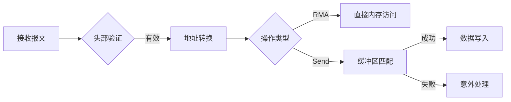

# UEC SES缓冲区队列与映射实现

## 一.libfabic 接口给消息任务到SES
    
![[1 1.png]]

    A[应用层] -->| fi_send/fi_write | B[Libfabric API]
    B --> C[SES提供者]
    C --> D[构造SES头部]
    D --> E[提交PDS传输]

## 二.数据格式

### 2.1.消息格式
![[2.png]]
### 2.2 关键字段

__字段__ |   __长度__   |  __说明__ |__示例值__
|---------|---------|---------|---------|
opcod|1字节|操作类型|0x01（WRITE）
flags|1字节|控制标志（表3-8）|0x82（DC+REL）
job_id|3字节|分布式作业ID|0x00ABCD
resource_index|2字节|资源索引（服务标识）|0x0201
match_bits|8字节|标签匹配值/内存键|0xA5F3...
header_data|8字节|立即数据/控制信息|用户自定义

## 三、操作类型详解

__操作码__ |   __值__   |  __对应API__ |__负载要求__
|---------|---------|---------|---------|
UET_WRITE|0x01|fi_write()|任意长度数据
UET_READ|0x02|fi_read()|0字节（仅请求）
UET_SEND|0x03|fi_send()|任意长度数据
UET_TSEND|0x04|fi_tsend()|带标签数据
UET_ATOMIC|0x05|fi_atomic()|原子操作数

## 四、消息接收处理流程​
![[2 1.png]]

![[4.png]]

## 五、负载数据传输​
### ​1. 数据分段策略​
    // 负载附加在头部之后
    +-------------------+-----------------+
    ​| 40字节SES头部     | N字节负载数据   |
    +-------------------+-----------------+

#### 分段规则​​：
    1.​单包消息​​：≤4KB时使用优化头（图3-13）
    2.​多包消息​​：每包负载=MTU-头部大小
    3.​​结束标记​​：最后包设置EOM标志（图标准报文格式头）
